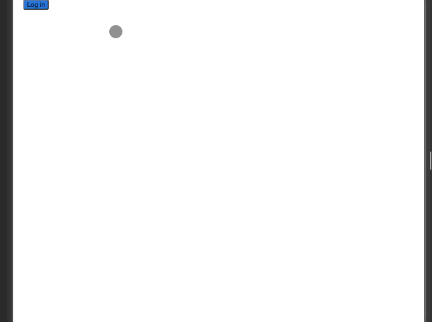

# Auth0 Exercise Tutorial
This project was done as a tutorial to learn about Auth0 Authentication

# About the Author
Name: Samira Mc Queen
[LinkedIn](https://www.linkedin.com/in/samira-mc-queen-1882431a7/)

Free Spririted Caribbean Woman.
Software Developer and aspiring Game Developer

# Project 

## Experience with Project
- This was my first time usig auth0 and it was fun!
- It is an easy authentication tool to use

# Application Features
- User can sign up with Auth0
- User can sign in with the account created with auth0
- User can view their information on home page 
- User can logout

# Frontend Built With
- React
- Auth0

# Project setup
Once the project is downloaded locally on your device do the following:
`
npm install
`

If there are dependencies that need updating or you want to check:
`
npm outdated
`

If there are outdated dependencies:
`
npm update
`

To check and update packages in package.json:
`
npx npm-check-updates -u
`

## Compiles and hot-reloads for development
`
npm run start
`
## Development Mode
`npm start
`

Runs the app in the development mode.\
Open [http://localhost:3000](http://localhost:3000) to view it in the browser.
